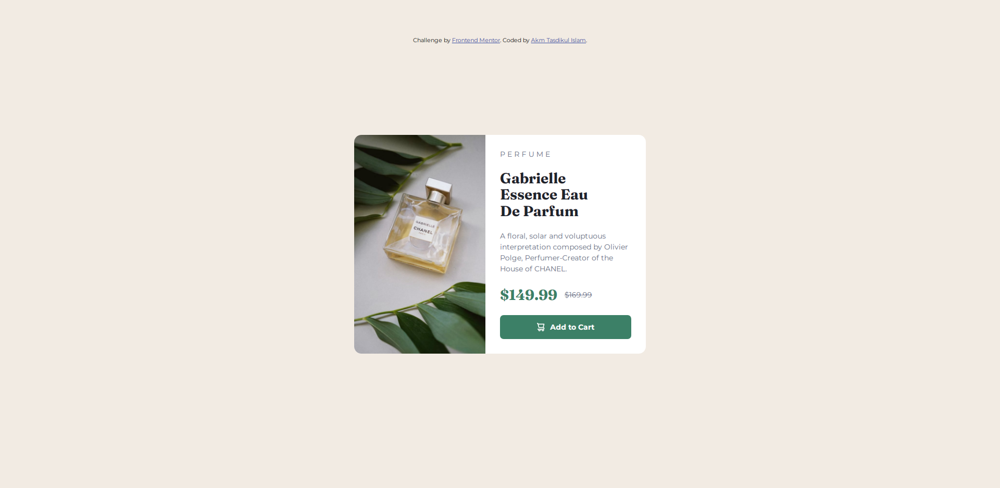
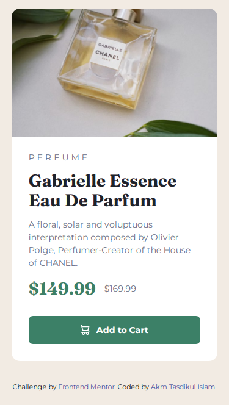

# Frontend Mentor - Product preview card component solution

This is a solution to the [Product preview card component challenge on Frontend Mentor](https://www.frontendmentor.io/challenges/product-preview-card-component-GO7UmttRfa). Frontend Mentor challenges help you improve your coding skills by building realistic projects. 

## Table of contents

- [Overview](#overview)
  - [The challenge](#the-challenge)
  - [Screenshot](#screenshot)
  - [Links](#links)
- [My process](#my-process)
  - [Built with](#built-with)
  - [What I learned](#what-i-learned)
  - [Continued development](#continued-development)
- [Author](#author)

### Overview

### The challenge

Users should be able to:

- View the optimal layout depending on their device's screen size
- See hover and focus states for interactive elements

### Screenshot

<!-- Markdown Styling -->
<style>
  .container{
    width="100%";
    display:flex;
    align-items:flex-end;
    gap:3px;
    text-align:center;
  }

  .desktop-view{
    width:75%;
  }

  .mobile-view{
    width:25%
  }
</style>

<div class="container">

  <div class="desktop-view">
    
    <p>Desktop View</p>
  </div>

  <div class="mobile-view">
    
    <p>Mobile View</p>
  </div>

</div>

### Links

- Solution URL: [https://github.com/akmtasdikulislam/product-preview-card-component](https://github.com/akmtasdikulislam/product-preview-card-component)
- Live Site URL: [https://akmtasdikulislam.github.io/product-preview-card-component/](https://akmtasdikulislam.github.io/product-preview-card-component/)

## My process

- First of all I made a container (.card) element. Then I distributed all the child elements (.card-image & .card-body) almost half of the available space.

- Then I included the product image inside .card-image and put all the text inside .card-body following the design.

- Then added css properties to make my development pixel perfect to the design.

### Built with

- HTML5
- CSS3
- Flexbox

### What I learned

I learnt responsiveness from thi challange.

To apply responsiveness, add @media query

```css
@media (max-width:375px)
```

### Continued development

I faced an error with responsiveness of the .card-body section. In the desktop view, I used padding in .card-body to have a gap between the elements and card edge. But for mobile design, padding was not working correctly. It overflowed of the card width. That's why I had to use margin-left explicitly to each of the .card-body elements to follow the design. So, I will develop further this challange porject if I can figure out and fix this issue.

## Author

- Website - [Akm Tasdikul Islam](http://www.tasdikul.rf.gd)
- Frontend Mentor - [@akmtasdikulislam](https://www.frontendmentor.io/profile/akmtasdikulislam)
- Twitter - [@Akm_Tasdikul](https://www.twitter.com/@Akm_Tasdikul)